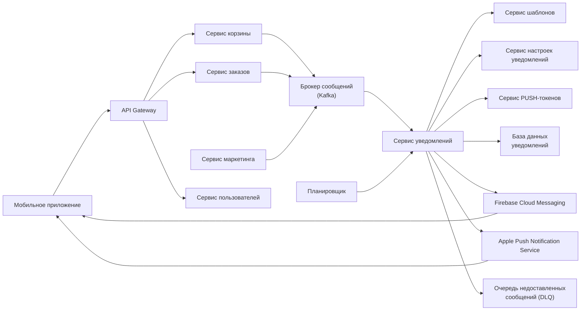

```mermaid
flowchart LR

    Mobile["Мобильное приложение"]

    Gateway["API Gateway"]

    Cart["Сервис корзины"]
    Order["Сервис заказов"]
    Marketing["Сервис маркетинга"]
    User["Сервис пользователей"]

    Broker["Брокер сообщений<br/>(Kafka)"]

    Notification["Сервис уведомлений"]

    Template["Сервис шаблонов"]
    Preference["Сервис настроек уведомлений"]
    Token["Сервис PUSH-токенов"]

    Scheduler["Планировщик"]

    FCM["Firebase Cloud Messaging"]
    APNS["Apple Push Notification Service"]

    DB["База данных<br/>уведомлений"]

    DLQ["Очередь недоставленных<br/>сообщений (DLQ)"]


    Mobile --> Gateway

    Gateway --> Cart
    Gateway --> Order
    Gateway --> User

    Cart --> Broker
    Order --> Broker
    Marketing --> Broker

    Broker --> Notification

    Scheduler --> Notification

    Notification --> Template
    Notification --> Preference
    Notification --> Token

    Notification --> DB

    Notification --> FCM
    Notification --> APNS

    FCM --> Mobile
    APNS --> Mobile

    Notification --> DLQ
```